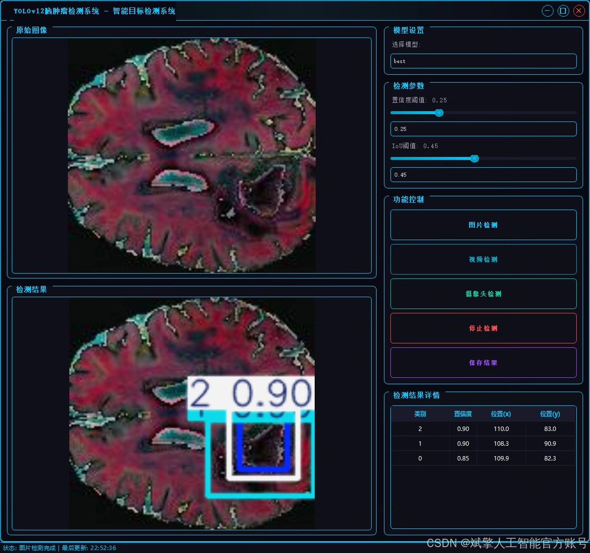
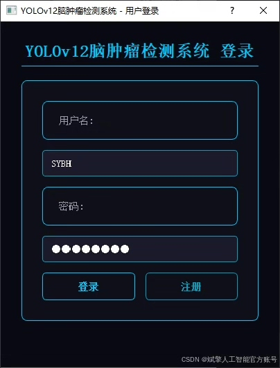
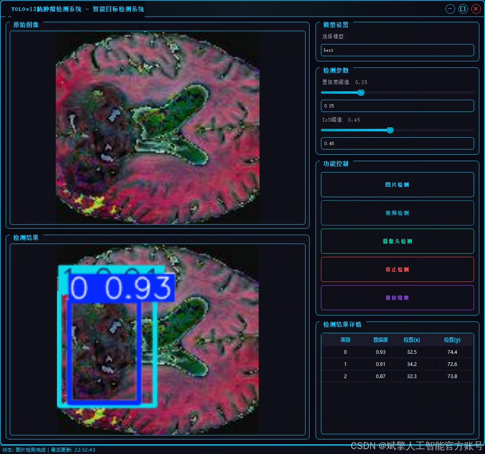
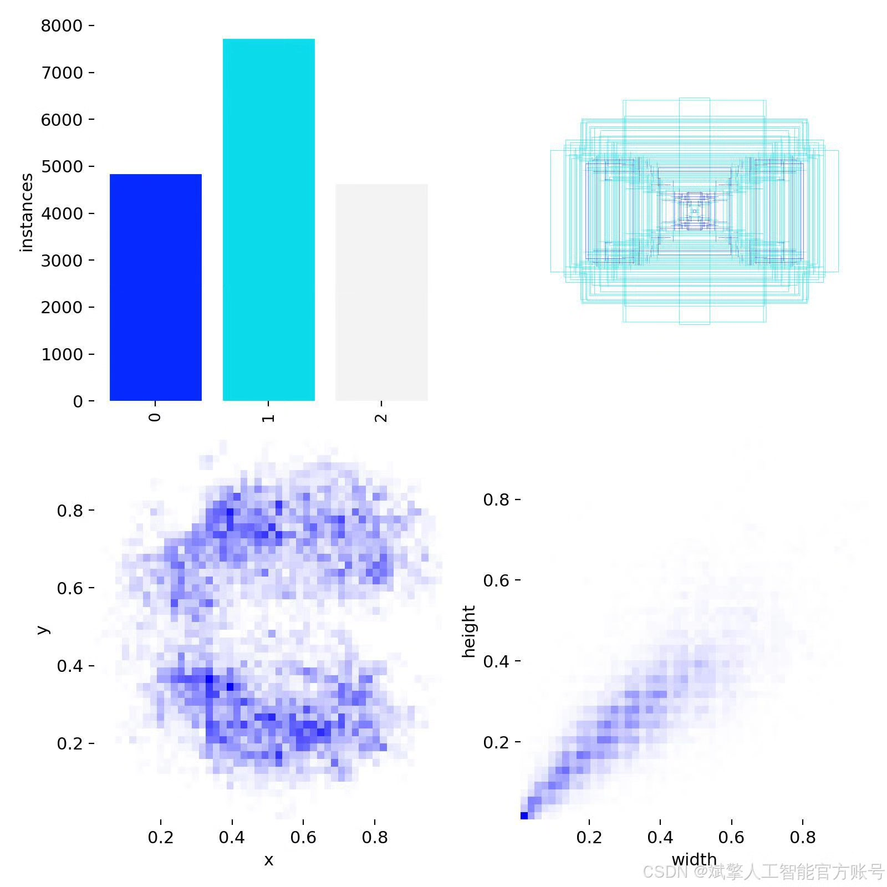
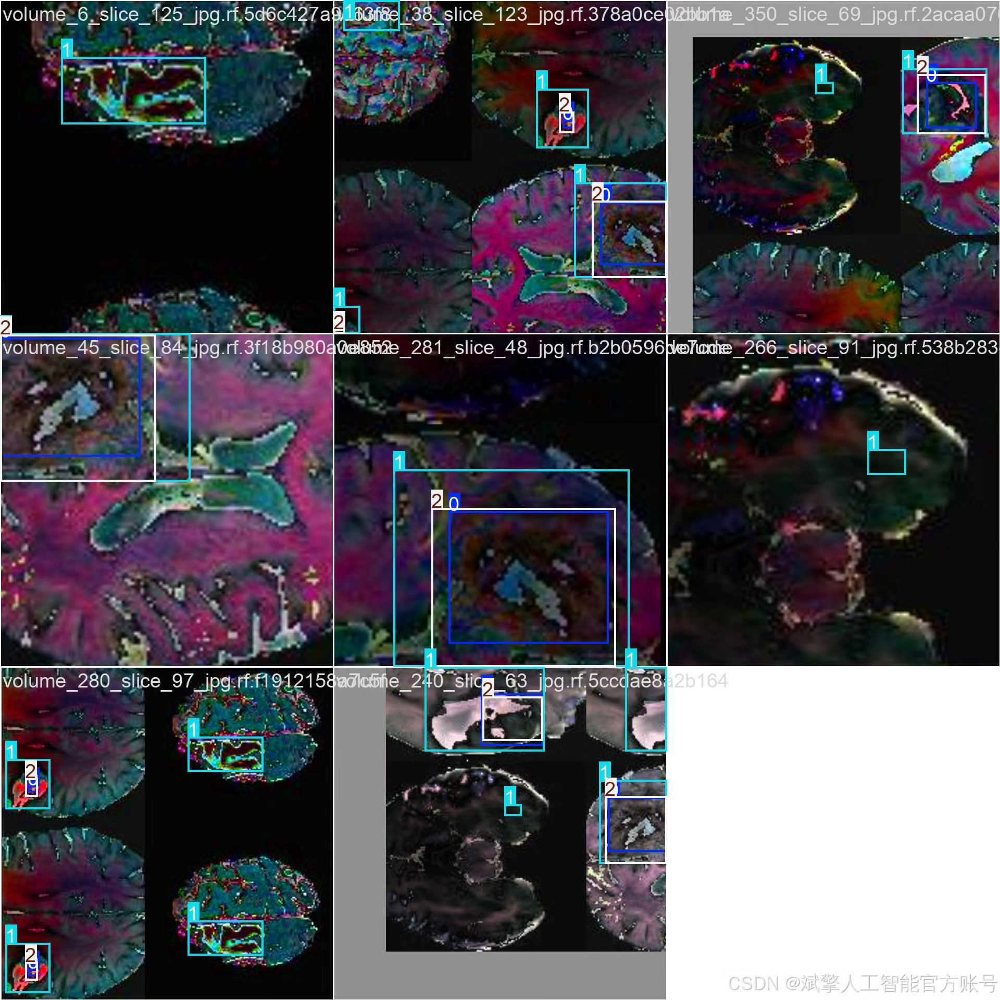
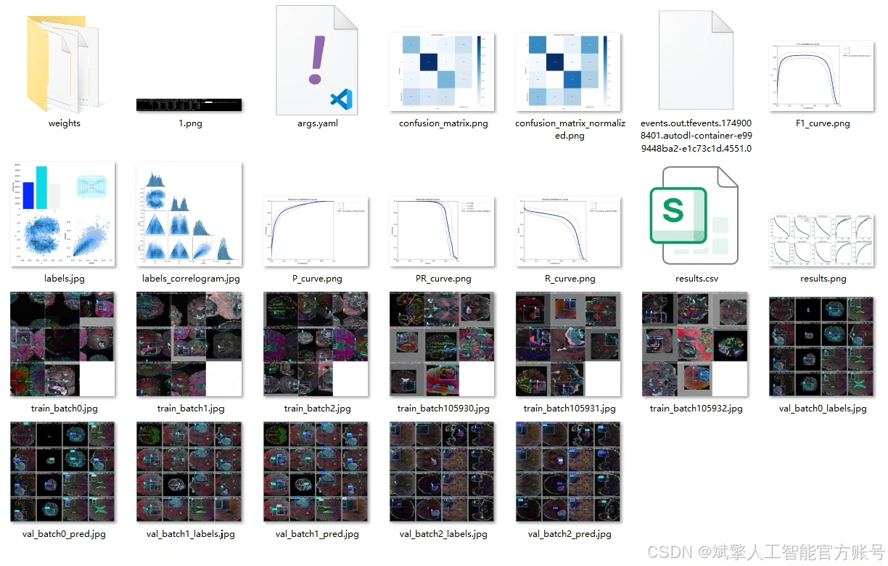
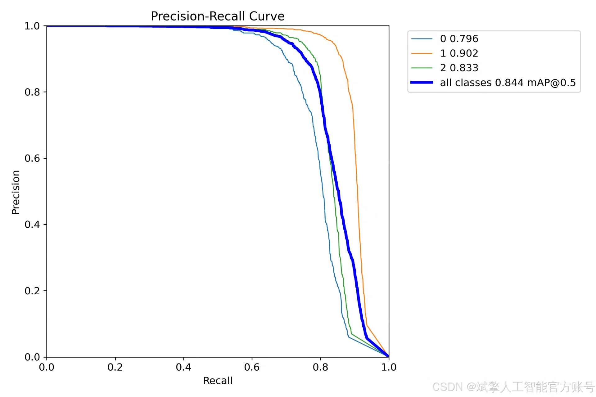
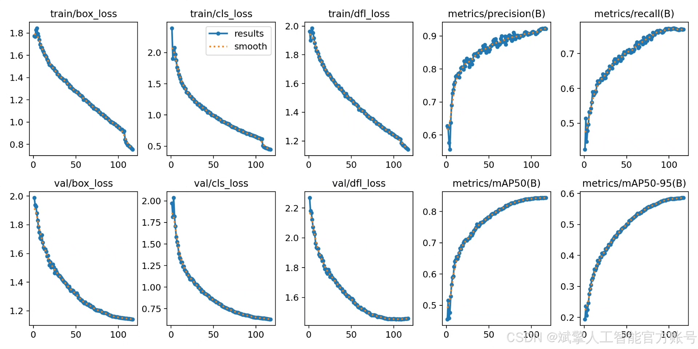
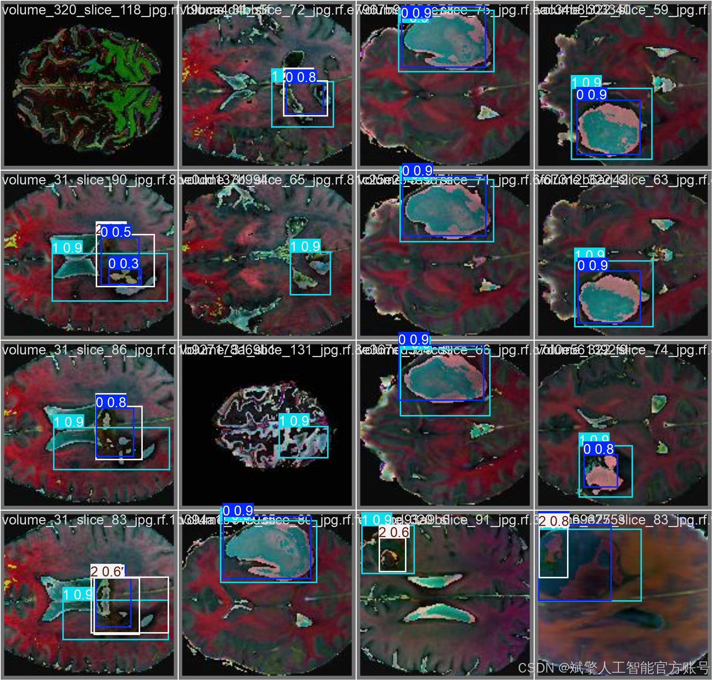

# YOLOv12 Brain Tumor Detection System

## Body

YOLOv12 Brain Tumor Detection System Based on Deep Learning YOLOv12

This paper designs and implements a brain tumor detection system based on the deep learning YOLOv12 algorithm. By integrating computer vision and medical image analysis techniques, it aims to enhance the automation and accuracy of brain tumor diagnosis. The system adopts an improved YOLOv12 model as the core detection framework, significantly improving sensitivity and localization precision for small-scale tumors through optimization of network structure and training strategies. In terms of data, it integrates publicly available YOLO format brain tumor imaging data and performs data augmentation and annotation optimization to enhance the model's generalization capabilities. The system's front end features a user-friendly UI interface that supports medical image uploading, real-time detection, and result visualization.

Dataset:
nc: 3 classes,
Name: ["0", "2", "3"],
Dataset quantity: 7920 training images, 1980 validation images.

✅ User login registration: Supports password verification and security validation.
✅ Three detection modes: Based on the YOLOv12 model, supporting image, video, and real-time camera detection, with precise target recognition.
✅ Dual-screen comparison: Display original images and detection results in the same screen.
✅ Data visualization: Real-time table displaying the category, confidence, and coordinates of detected targets.
✅ Intelligent parameter adjustment: Offers a confidence slide bar, dynamically optimizing detection accuracy to meet different scene needs.
✅ Sci-fi style interactive interface: Dark theme combined with dynamic light effects, reducing visual fatigue and enhancing operational experience.

## Images

## Payment

Here is a pay link on Stripe ( https://buy.stripe.com/3cs8yP7sY87d0vu9AB ). Please contact me lonlonago@foxmail.com after funding $89, and I will send you a complete data files , thank you!

